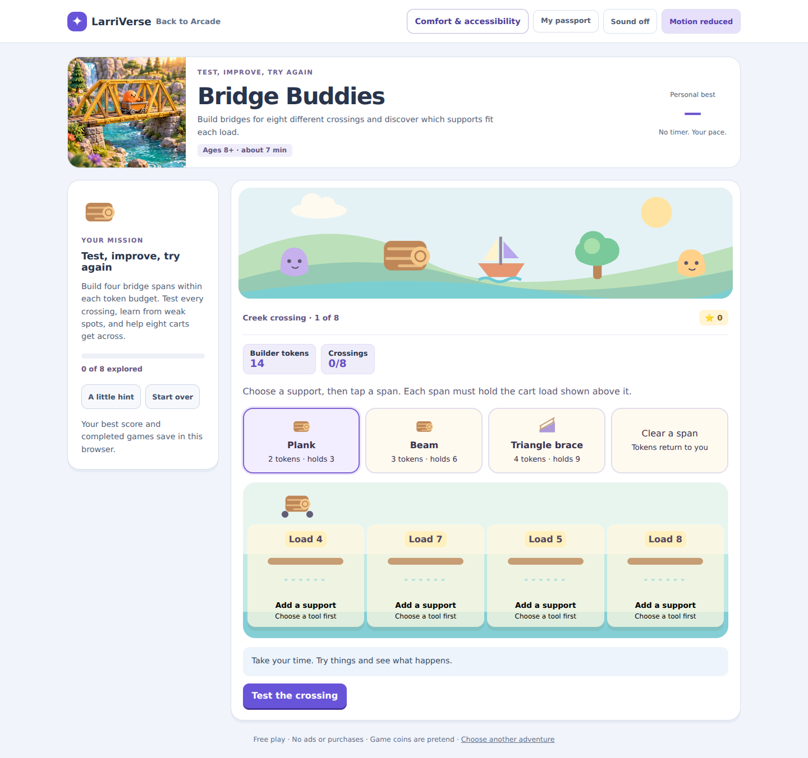
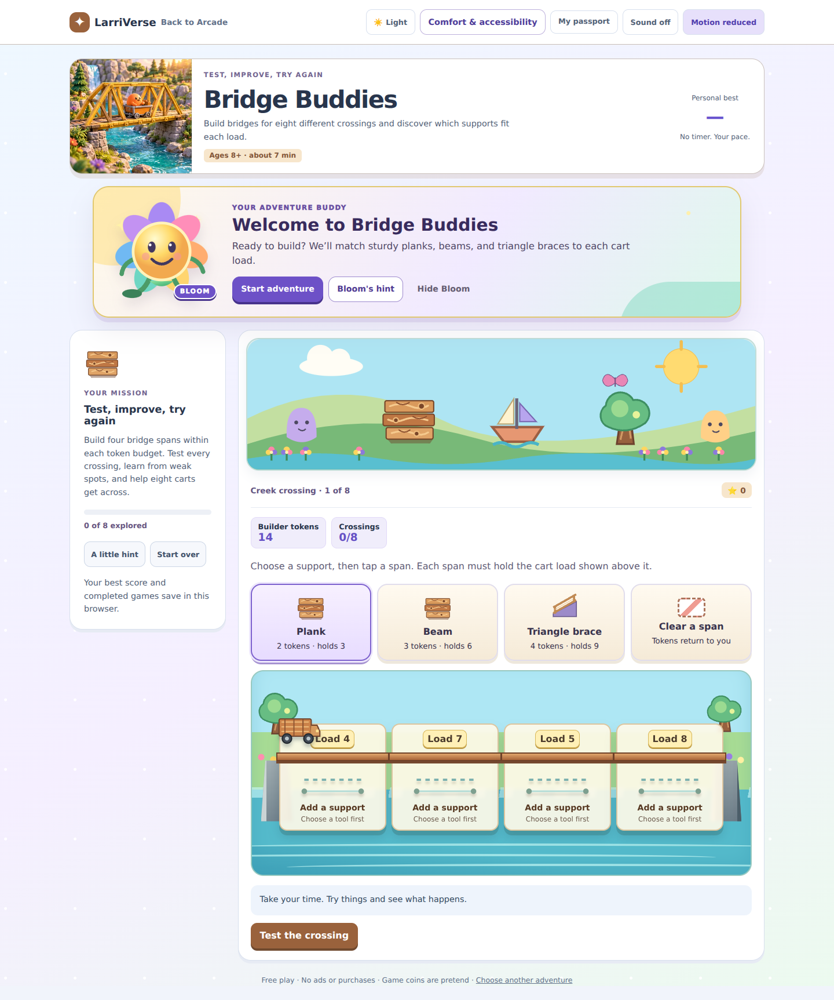
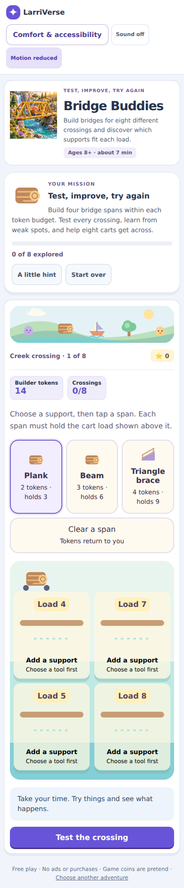
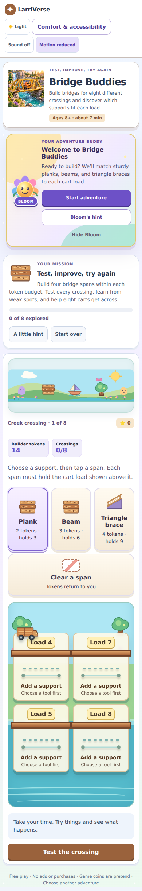
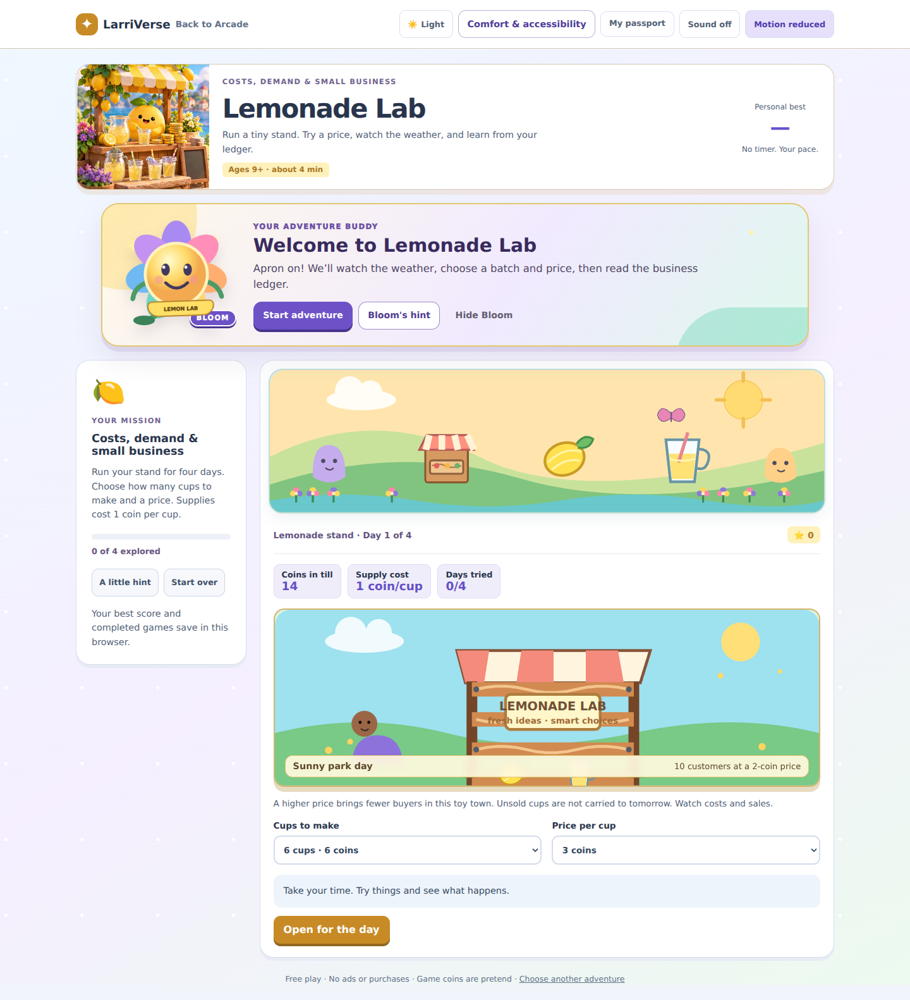
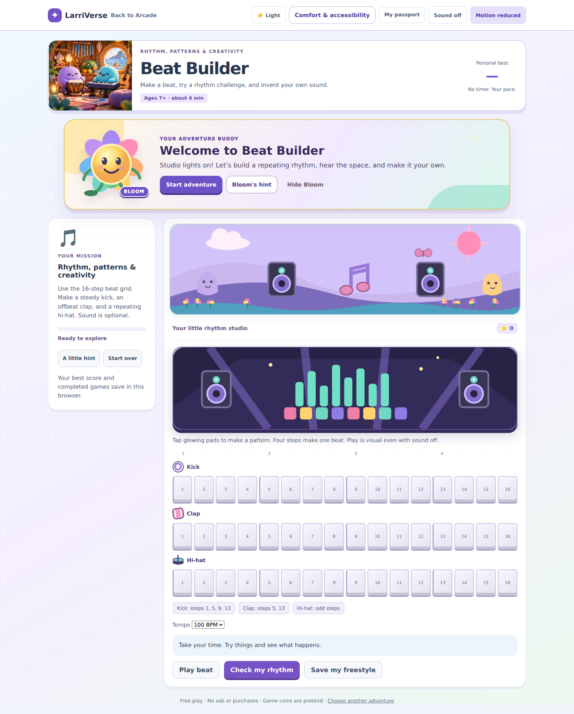
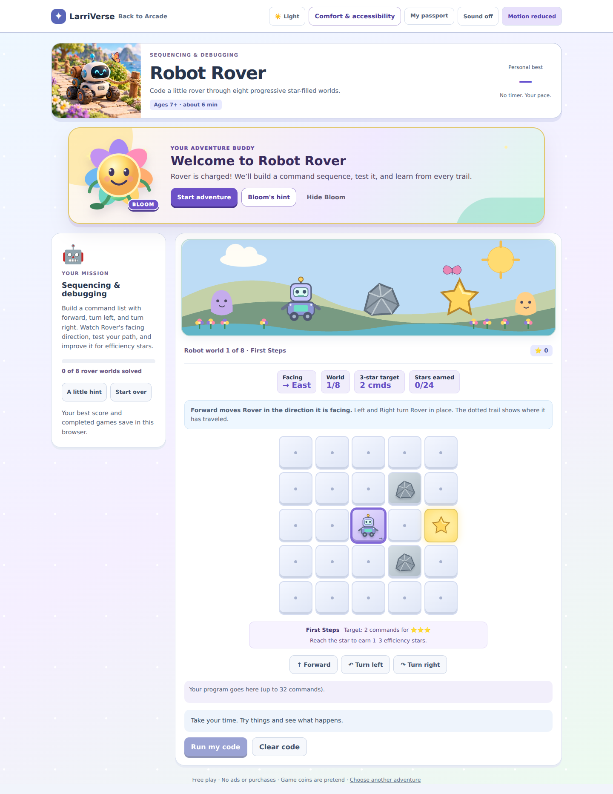
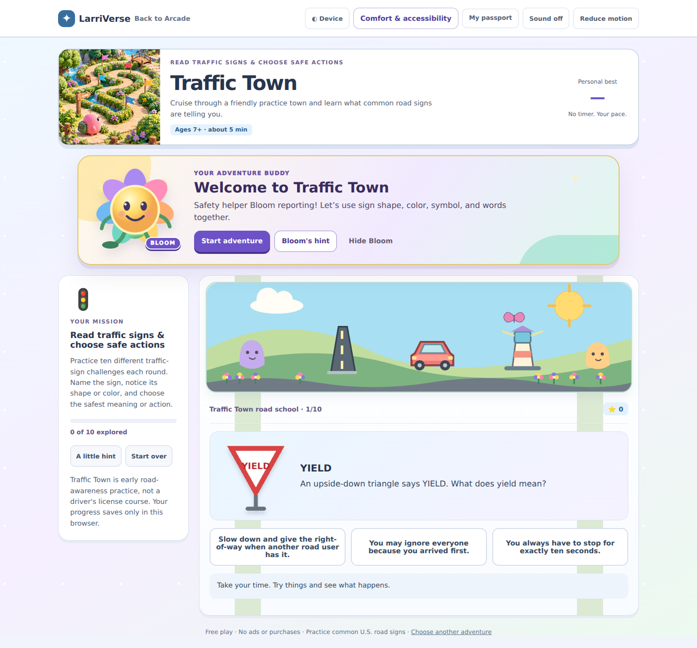
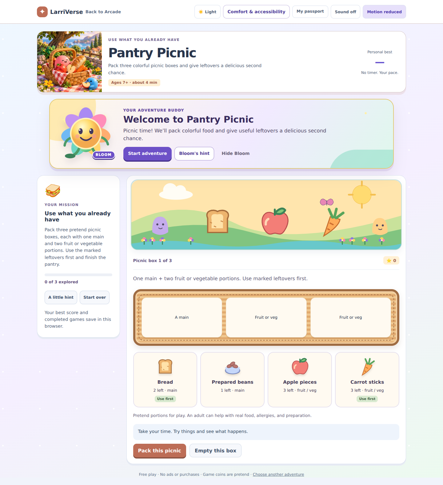
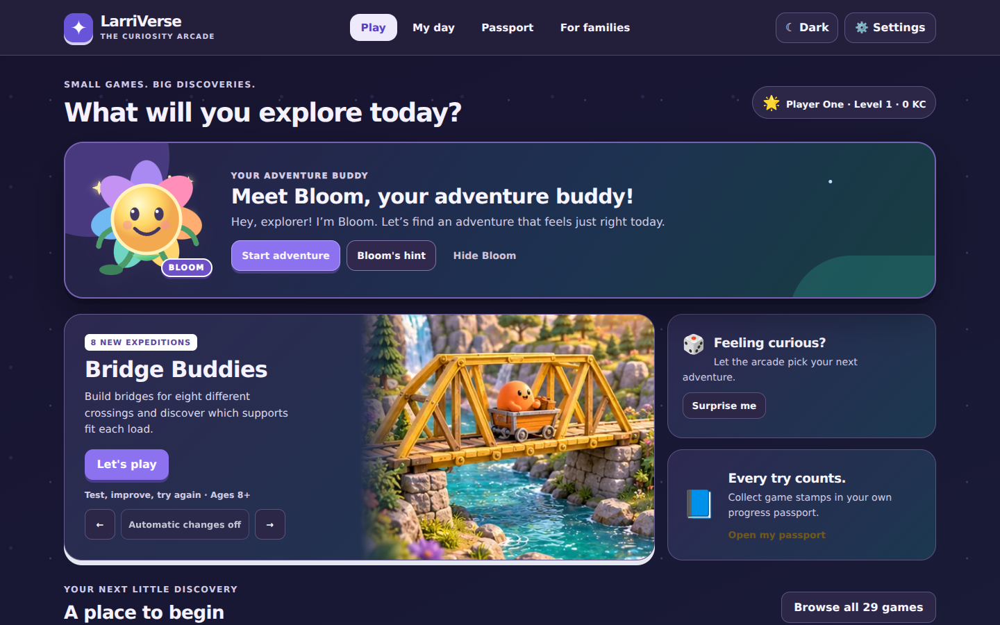

# LarriVerse Magical Makeover

This branch upgrades the original 30 cabinets and adds two complete picture-learning worlds, bringing the arcade to 32 without replacing gameplay, question banks, local progress, rewards, accessibility controls, release evidence, or manual approval.

## Shared foundation

- Light, dark, and follow-device themes are part of the existing device-local comfort record.
- Dark mode changes both interface surfaces and world scenery: stars, moonlight, glowing flowers, deeper terrain, and readable controls.
- Every cabinet receives a visible theme shortcut and the three-way selector remains available in Comfort & accessibility.
- Bloom is a reusable, local SVG guide with welcome, thinking, cheering, and celebration poses.
- Bloom has a different welcome and hint for every one of the 32 games.
- Bloom can be hidden or restored, never needs an account, never sends child data, and respects reduced motion.
- Existing feedback can update Bloom with encouraging, non-shaming language.

## Artwork upgrades

### Highest-priority cabinets

- **Bridge Buddies:** unmistakably different plank, beam, and triangle-brace models; layered wood faces and grain; bolts; a continuous deck; stone abutments and piers; dimensional shadows; and twenty detailed cargo vehicles moving through distinct crossing scenes and four advancement ranks.
- **Lemonade Lab:** a full wooden stand with separate boards, grain, fasteners, striped canopy, lemons, cups, customer, plants, and changing sunny, rainy, festival, and quiet-day scenes. Bloom wears a Lemon Lab apron.
- **Beat Builder:** illustrated studio, speakers, animated equalizer, stage lighting, custom track symbols, dimensional rhythm pads, playhead glow, and dancing Bloom.
- **Robot Rover:** a paneled rover with antenna, face display, body lights, arms, wheels, and fasteners; faceted rock obstacles; glowing goal stars; and clear trail markers.
- **Traffic Town:** all 40 rendered traffic signs have distinct identifying symbols, shapes, and colors, including dimensional cow, deer, tractor, truck, turn-only, dead-end, clearance, and work-zone signs.
- **Street Safety Scout:** 36 distinct code-native scenes combine dimensional signals, reflective sign faces, school buses, emergency vehicles, car lights, roadside workers, farm equipment, animals, road surfaces, water, fog, crosswalks, and cast shadows with accessible image labels.
- **Pantry Picnic:** thirteen detailed vector foods, including rice, wraps, pasta, fruit, and vegetables, plus a layered wicker basket, cloth texture, and dimensional food cards.

### Every other cabinet

- The 21 shared-world cabinets now open into mode-specific illustrated scenery with layered sky, terrain, water, flowers, trees, butterflies, friendly characters, and recognizable SVG props.
- Water, metal, stone, roads, buildings, food, robots, boats, markets, benches, ramps, tools, and plants use shaped vector artwork with edges, texture, highlights, and shadows.
- The eight recovered classic cabinets retain their own mechanics and art while gaining Bloom, shared day/night controls, stronger backgrounds, and the common comfort system.

## Accessibility and privacy

- Keyboard focus remains visible.
- Bloom does not block gameplay and its Start button only moves focus to the existing play area.
- High contrast overrides decorative themes.
- Reduced motion stops Bloom, scenery, cart, water, equalizer, and decorative animation.
- Sound remains opt-in and cabinet-owned.
- All preferences and progress stay in browser storage and remain covered by backup/restore.

## Verification

- `npm run validate` includes a dedicated magical-makeover contract in addition to the existing validators, including a distinct-art check across all 40 Traffic Town signs.
- Browser QA covers theme persistence, device-theme response, Bloom hints, hide/restore, overflow, all cabinet routes, mobile/desktop layouts, accessibility settings, saves, and gameplay flows.
- The existing GitHub Actions browser gate produces genuine desktop/mobile screenshots and the offline review gallery. The release approval gate is unchanged.

## Review screenshots

The same Bridge Buddies opening state is shown before and after the makeover.

| Before | After |
| --- | --- |
|  |  |
|  |  |

| Priority cabinet | After makeover |
| --- | --- |
| Lemonade Lab |  |
| Beat Builder |  |
| Robot Rover |  |
| Traffic Town |  |
| Pantry Picnic |  |
| Night lobby |  |

## Review boundary

This work is delivered on a feature branch for owner review. It does not merge, deploy GitHub Pages, tag a release, or create approval evidence.
